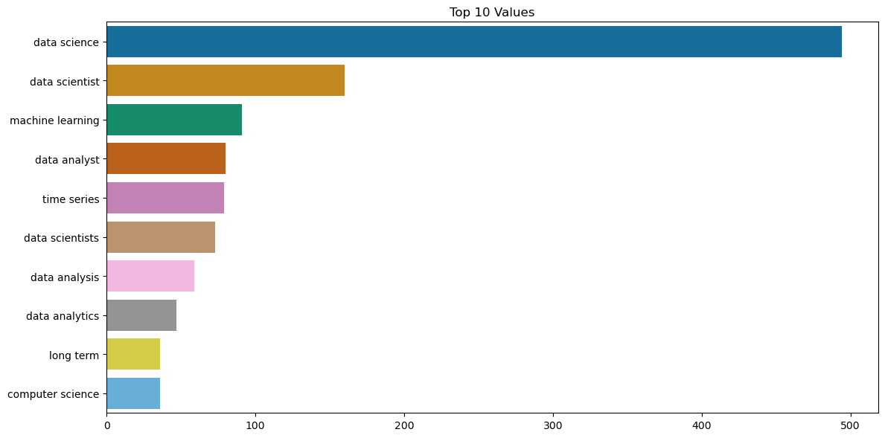
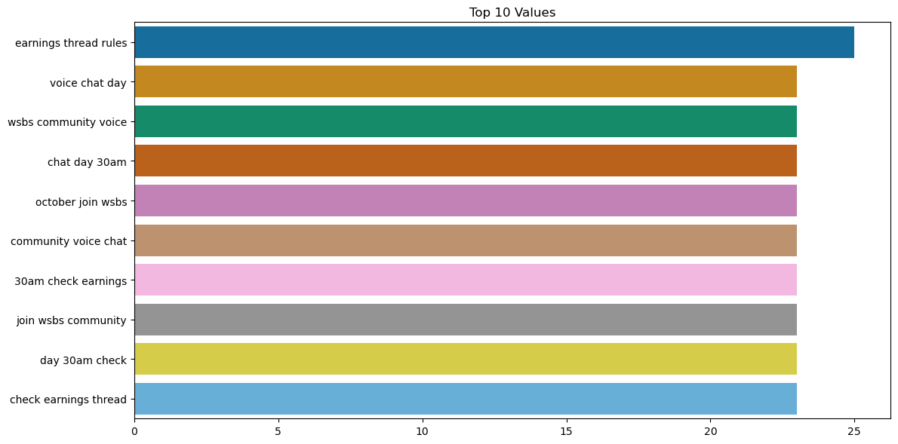

## Executive Summary:

In this project the goal was to classify posts from two contrasting subreddits: datascience and wallstreetbets. Using the PRAW framework, posts were systematically crawled from Reddit. Through exploratory data analysis, distinctive bigram patterns emerged for each subreddit. The patterns were further solidified using TSNE visualizations, which highlighted the efficacy of unigram and bigram features in clustering posts. After EDA I concluded with modeling using GridSearchCV that resulted in a classifier with an outstanding accuracy of over 95%. The classifier's practical peformance was demonstrated by its accurate categorization of synthetic posts.

## Problem Statement:
In this project, we want to see if we can tell apart posts from two popular subreddits: datascience and wallstreetbets, or any two subreddits or categories a text might belong to in general. Can we create a simple tool that accurately says which group a post is more likely to come from? And what words or phrases give us the best clues about this?

## Data Collection:
Utilizing the PRAW framework, we successfully crawled Reddit to retrieve posts from the subreddits.

## Exploratory Data Analysis (EDA):
Upon analyzing the WordCount from each subreddit, we can observe distinctive patterns:

The datascience subreddit frequently displayed bigrams as visualized:



The wallstreetbets subreddit presented its own unique bigram counts:



TSNE visualizations further underscored that unigram and bigram features yielded the most coherent clustering of the data, as can be seen:
Model Performance:


I then trained a model using LogisticRegression and GridSearchCV that resulted in an impressive accuracy rate exceeding 95%. The parameter of the model and the TfIdfVecotrizer are as follows:

```
{'logit__C': 5, # Best Alpha
 'logit__max_iter': 1000,
 'logit__penalty': 'l2', # Ridge Regularizer 
 'logit__solver': 'liblinear',
 'tvec__min_df': 1,
 'tvec__ngram_range': (1, 1), # Vectorize with only unigrams
 'tvec__stop_words': 'english' # Remove Stop words
 } 
 ```

This classifier has demonstrated its practical performance by correctly discerning patterns within posts and categorizing them accurately. This efficacy is evident when testing on synthetic posts:

| input                                                      | model prediction |
|------------------------------------------------------------|------------------|
| I made $1000 on the stock market today! let's go baby!             | wallstreetbets   |
| How do I remove null objects from my dataset?              | datascience      |
| Guys I need some investment decisions, please help.              | wallstreetbets   |
| I trained a Logistic Regression model to classify the subreddits of a given post.             | datascience      |

## File Directory/table of contents


├── reddit_project.ipynb      
│   
├── Presentation folder  
│   ├── Project 3 Presentation.pdf  


## Conclusions:

The logistic classifier trained using GridSearch has not only achieved a high degree of accuracy but has also showcased its practical application by correctly categorizing synthetic posts. This project underscores the power of data-driven insights and ML in drawing meaningful distinctions from large volumes of textual data. 


## Sources:

- Practical Statistics for Data Scientists by Peter Bruce, Andrew Bruce, and Peter Gedeck
- Artificial Intelligence: A Modern Approach by Staurt Russell and Peter Norvig

## Authors
- [Muhammad Affan Hassan](hassan.affan@gmail.com)
